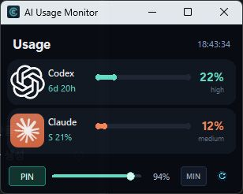
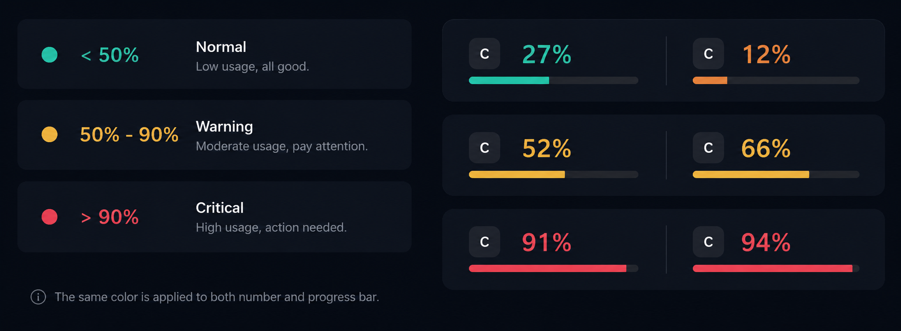

# AI Desktop Usage Monitor

Small Windows desktop HUD for local Codex and Claude Desktop usage signals.

It is designed as a lightweight glanceable monitor: keep the tiny strip near the edge of your screen, then double-click it when you need the full HUD.

## What it shows

- ChatGPT / Codex usage from local Codex session logs
- Claude Desktop usage from Claude's local usage cache
- Compact always-on-top HUD
- Tiny titlebar-free mode with icon + percentage
- Opacity control, manual refresh, and 50% / 90% threshold colors

## Data sources

This app only reads local files and Windows accessibility text. It does not call OpenAI, Anthropic, or any external API.

| Provider | Source | Confidence |
| --- | --- | --- |
| ChatGPT / Codex | `~/.codex/sessions/**/*.jsonl`, extracting `rate_limits` | High |
| Claude Desktop | Claude Desktop `plan-usage-history.json` | Medium |
| Claude fallback | Claude Desktop logs and Windows UI Automation when available | Medium / Low |

Claude Desktop's local usage schema is not a public Anthropic API. The app currently treats:

- `fh` as the five-hour usage window
- `sd` as a Sonnet-related usage signal
- `wk` / `7d` as weekly usage, when present

If Claude has not refreshed its local cache recently, the monitor marks the value as stale instead of pretending it is live.

## Privacy and security

The app is intentionally local-first:

- No credentials, cookies, auth files, screenshots, or OCR are read.
- No network requests are made by the monitor.
- The app reads only usage-related local logs/cache files.
- CLI output shortens source paths with `~` to avoid exposing the local username.

Before publishing or forking, do not commit local-only artifacts:

- `AI Usage Monitor.lnk`
- `.agents/`
- `.codex/`
- `.venv/`
- copied provider icons such as `assets/chatgpt.png` or `assets/claude.png`
- logs, `.env`, personal screenshots, or local cache files

The included app icon and refresh icon are project-local generated assets. Provider logos, if present locally, are only used as local convenience assets and should not be redistributed unless you have the right to do so.

## Run

PowerShell:

```powershell
.\run_monitor.ps1
```

Collector-only smoke test:

```powershell
.\run_monitor.ps1 -Once
```

JSON output:

```powershell
.\run_monitor.ps1 -Once -Json
```

Python discovery order:

1. `AI_USAGE_MONITOR_PYTHON`, if set
2. local `.venv\Scripts\python.exe`
3. Codex bundled runtime under `~\.cache\codex-runtimes\...`, when available
4. `py -3`
5. `python`

If Python is not detected automatically, set:

```powershell
$env:AI_USAGE_MONITOR_PYTHON = "C:\Path\To\python.exe"
.\run_monitor.ps1
```

`AI Usage Monitor.vbs` is available as a hidden-console launcher. For a custom Windows icon, create a local shortcut to that `.vbs` file instead of committing a `.lnk` file.


## Path configuration

No provider path setup is required for the default Windows desktop setup.

The monitor automatically checks these locations under the current Windows user profile:

| Provider | Default path |
| --- | --- |
| ChatGPT / Codex | `%USERPROFILE%\.codex\sessions\**\*.jsonl` |
| Claude Desktop | `%USERPROFILE%\AppData\Local\Packages\Claude_pzs8sxrjxfjjc\LocalCache\Roaming\Claude\plan-usage-history.json` |
| Claude logs fallback | `%USERPROFILE%\AppData\Local\Packages\Claude_pzs8sxrjxfjjc\LocalCache\Roaming\Claude\logs\*.log` |

If the monitor shows `missing`, check that:

1. Codex or Claude Desktop has been run at least once on that Windows account.
2. Codex has created local session logs containing `rate_limits`.
3. Claude Desktop has created or refreshed `plan-usage-history.json`.
4. You are running the monitor under the same Windows user account that uses Codex / Claude Desktop.

Currently, custom provider log paths are not exposed as command-line options. If your apps store data in a non-standard location, update the path construction in `collect_codex_usage()` or `collect_claude_usage()` in `app.py`.

## UI

The monitor uses a simple dark rounded-card HUD layout.

### Full HUD



- `PIN`: toggles always-on-top
- opacity slider: makes the window less intrusive
- refresh icon: updates immediately
- `MIN`: switches to the tiny titlebar-free strip
- tiny strip drag: moves the strip
- tiny strip double-click: returns to the full HUD

### Mini HUD


Usage colors escalate at:

- `< 50%`: normal provider color
- `>= 50%`: warning color
- `>= 90%`: critical color



## Limitations

- Claude Desktop values depend on internal local cache/log formats and may change.
- The Claude UI fallback is best-effort; some views do not expose usage text through Windows accessibility APIs.
- Codex usage depends on local Codex session logs containing `rate_limits`.
- This is a personal desktop monitor, not an official billing or quota API client.

## Suggested repository checklist

- Add a license, for example MIT, if you want others to reuse the code.
- Keep `.gitignore` intact before the first commit.
- Commit source files and generated project icons only.
- Do not commit local shortcuts, copied provider logos, logs, caches, personal screenshots, or virtual environments.
- Mention clearly that Claude support is unofficial and cache-based.
